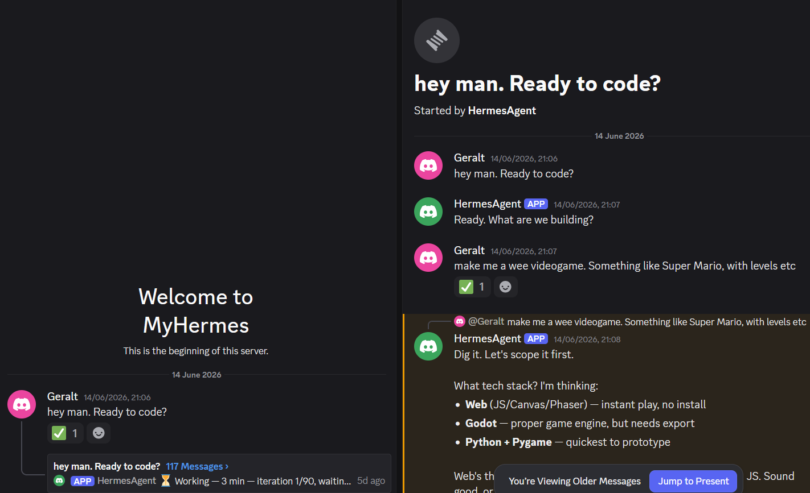

# Autonomous Builder

> A Discord-controlled autonomous web app pipeline powered by [Hermes Agent](https://github.com/NousResearch/hermes-agent) by Nous Research.



You describe what you want built. The agent clarifies, plans, waits for your approval, builds, runs a security review, deploys to Vercel, and pushes to GitHub — without you touching a terminal.

---

## How It Works

Send a message in Discord. Get a live URL and a GitHub repo back.

```
Discord message
      ↓
Clarification       up to 3 rounds of questions
      ↓
Planning            writes PLAN.md, placeholder .env
      ↓
Approval Gate ←──── hard stop — waits for your YES
      ↓
Build               creates all files, runs npm install
      ↓
Validation          build + tests must pass
      ↓
Code Review         subagent checks 10 security rules — PASS or FAIL
      ↓
Deploy              Vercel production deployment
      ↓
Approval Gate ←──── confirms live URL — waits for your YES
      ↓
GitHub Push         README + structured commit + repo creation
      ↓
Report              live URL · repo URL · build verdicts
```

The agent cannot skip phases and cannot write a single line of code before you approve the plan. Built with AgentOps principles in mind — human-in-the-loop approval gates, multi-agent coordination, and a structured audit trail at every phase.

---

## Stack

| | |
|---|---|
| Agent framework | [Hermes Agent](https://github.com/NousResearch/hermes-agent) v0.16.0 |
| Model | DeepSeek V4 Flash via OpenRouter |
| Interface | Discord (gateway mode) |
| Deploy target | Vercel |
| Version control | GitHub via `gh` CLI |
| Runtime | WSL2 (Ubuntu) on Windows |
| Default database | Neon (serverless Postgres) |

---

## Repo Structure

```
autonomous-builder/
├── SOUL.md                          # Agent identity and voice
├── config.yaml                      # Hermes profile config (no secrets)
└── skills/
    └── software-development/
        └── web-app-pipeline/
            ├── SKILL.md             # 10-phase pipeline
            └── references/
                ├── security-rules.md        # 10 rules enforced at code review
                ├── stack-rules.md           # Vercel constraints and stack choices
                └── commit-readme-rules.md   # Commit format and README template
```

The skill uses a progressive disclosure pattern — `SKILL.md` stays lean, reference documents load only during the phase that needs them.

---

## Security Model

Every build is reviewed by a subagent before deployment:

- No secrets in source files or the browser bundle
- All third-party API calls proxied server-side: `Browser → /api/* → Third-party API`
- Security headers enforced via `vercel.json`
- Rate limiting via Upstash Redis (never `express-rate-limit` with MemoryStore)
- `.gitignore` validated — `.env`, `node_modules/`, `.vercel/`, `dist/` must be present
- Any violation is an automatic FAIL — the pipeline stops, nothing deploys

Full rules in `skills/software-development/web-app-pipeline/references/security-rules.md`.

---

## Apps Built With This Pipeline

| Project | Stack | Live |
|---------|-------|------|
| Weather dashboard | React + Vite + OpenWeatherMap proxy | [View](https://weather-dashboard-six-dun.vercel.app/) |

---

## Installation

```bash
# Place the skill in your Hermes profile
cp -r skills/software-development/web-app-pipeline \
  ~/.hermes/profiles/<your-profile>/skills/software-development/

# Copy SOUL.md and config.yaml to your profile
cp SOUL.md ~/.hermes/profiles/<your-profile>/SOUL.md
cp config.yaml ~/.hermes/profiles/<your-profile>/config.yaml

# Add your tokens to the profile .env
echo "GH_TOKEN=your_github_token" >> ~/.hermes/profiles/<your-profile>/.env
echo "VERCEL_TOKEN=your_vercel_token" >> ~/.hermes/profiles/<your-profile>/.env

# Start the gateway
tmux new -s hermes '<your-profile> gateway run'
```

Then in Discord, start a new thread and type `/web-app-pipeline`.

---

## Roadmap

- [ ] Observability tooling — trace pipeline runs and LLM calls end-to-end
- [ ] Upstash Redis integration baked into the default stack
- [ ] Bundle with `node-express-backend` and `systematic-debugging` skills
- [ ] Publish to agentskills.io open standard registry

---

Built by Manuele · [LinkedIn](https://www.linkedin.com/in/manueletacchetti/)